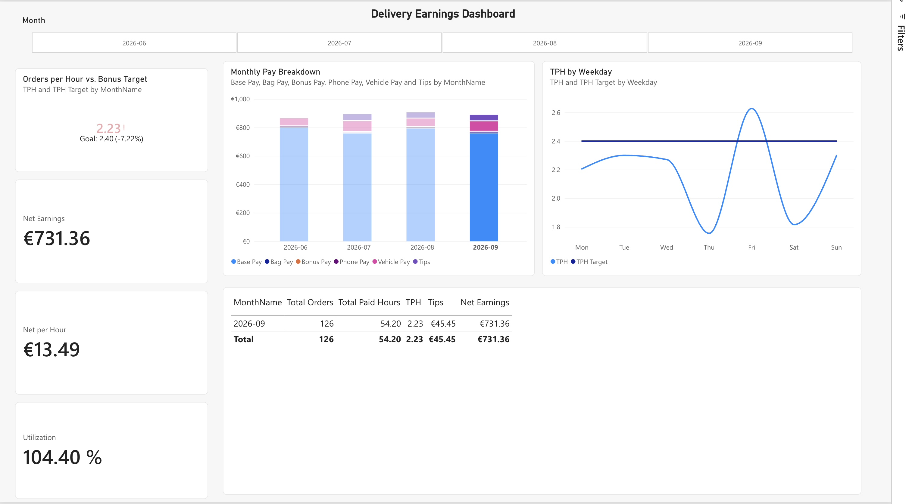

# Delivery Earnings KPI Dashboard (Power BI)

An end-to-end Power BI project built on my own work data as a part-time delivery rider. I tracked every shift and delivery in Excel (orders, hours, kilometres and tips) and turned it into a KPI dashboard. The goal was to answer one question: **how close am I to the performance bonus, and what drives it?**



---

## The problem

My employer pays a performance bonus once a rider averages more than **2.4 orders per hour**. I wanted to know:

- How far am I from the bonus threshold?
- What do I actually earn per hour after deductions?
- Which days and shifts perform best, and where should I put my hours?

## Dataset

| | |
|---|---|
| **Source** | Personal Excel tracker, filled in after every shift |
| **Period** | June – September 2026 (4 months) |
| **Volume** | ~400 orders across 200+ working hours |
| **Fields** | Date, shift start/end, hours assigned, paid minutes, worked flag, orders, kilometres, tips |

> **Note:** The data is my own. Monetary values in this repo may be scaled for privacy; order counts and hours are unchanged.

## What I did

### 1. Data cleaning (Power Query)
- Removed blank and incomplete rows
- Fixed data types (dates, times, decimals, whole numbers)
- Found and removed duplicate entries
- Added derived columns such as month, paid hours and a worked/not-worked flag

### 2. Data model
- Star schema with a dedicated **Calendar** (date) table linked to two fact tables: **Shifts** (scheduled, paid hours) and **Sessions** (active delivery time, orders, km, tips)
- Supporting tables for settings and bonus tiers
- Relationships set up so every measure can be sliced by day, weekday and month

### 3. DAX measures (18 in total)

| Group | Measures |
|---|---|
| **Volume** | Total Orders, Active Hours, Total Paid Hours |
| **Performance** | **TPH** (orders per active hour), TPH Target (2.4), Utilization (active ÷ paid hours) |
| **Pay components** | Base Pay, Phone Pay, Vehicle Pay (per km), Bag Pay, Tips |
| **Bonus** | **Bonus Rate**: 23-tier lookup with `SWITCH(TRUE(), …)` from 2.4 to 4.6 TPH<br>**Bonus Pay**: rate × paid hours, calculated per month with `SUMX` so multi-month totals are correct |
| **Earnings** | Gross, Pension (9.3% of wage-based pay), Health (flat monthly amount, only for months worked), Net Earnings, Net per Hour |

All measures, with comments, are in [`measures.dax`](measures.dax). The file can be run directly in Power BI's DAX query view.

### 4. Dashboard
- **KPI visual**: TPH (orders per hour) vs. bonus target
- **Cards**: net earnings and net pay per hour
- **Monthly pay breakdown**: gross, deductions, net, tips
- **Weekday analysis**: orders per hour by day of the week

### 5. Validation
I checked every measure against my original Excel calculations. Along the way I found and fixed several data issues, including duplicates and wrongly typed values.

## Key insights

- I'm about **0.14 orders per hour short** of the bonus threshold.
- **Sunday is the only day above target.** Every other weekday falls below 2.4.
- **Recommendation:** moving shift hours towards Sundays is the most direct way to reach the bonus.

## Tools

- **Power BI** (Service / web modeling): Power Query, data modeling, DAX, report design
- **Excel**: data collection and cross-checking

## Repository structure

```
├── Delivery Earnings Tracker.pbix   # Power BI report and data model
├── measures.dax                     # All DAX measures as plain text
├── screenshots/
│   └── dashboard.png
└── README.md
```

## How to open

1. Download `Delivery Earnings Tracker.pbix`.
2. Open it in **Power BI Desktop** (Windows), or upload it at [app.powerbi.com](https://app.powerbi.com) → *My workspace* → *Upload*.
3. If you only want to see the logic, `measures.dax` and the screenshot work without Power BI.

## Next steps

- Add more months as new shift data comes in
- Add a what-if parameter: how many extra Sunday hours are needed to reach 2.4 orders/hour?
- Look at the link between kilometres per order and orders per hour

---

**Author:** Nevil Amraniya · [LinkedIn](https://linkedin.com/in/nevil-amraniya)
